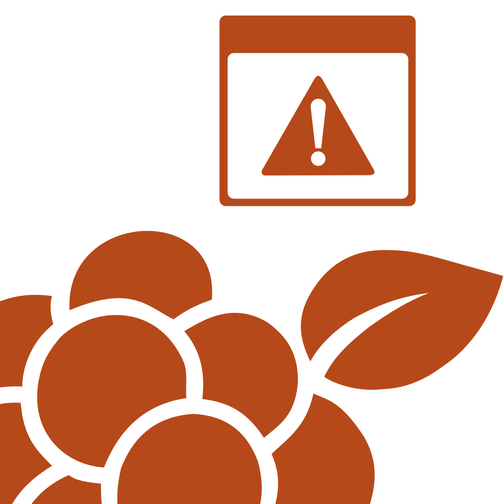

# Moroshka.Xcp

The `Moroshka.Xcp` module provides enhanced exception classes that extend the standard error-handling mechanisms in .NET. These exceptions include additional information such as unique error codes (`Code`), contextual details (`Context`), member names (`Member`), and line numbers (`Line`). This makes debugging and logging more informative.

## Installation

- [Installation - RU](../upm/Documentation~/installation-ru.md)
- [Installation - EN](../upm/Documentation~/installation-en.md)

## Instructions

- [Instructions - RU](../upm/Documentation~/instructions-ru.md)
- [Instructions - EN](../upm/Documentation~/instructions-en.md)

## Instructions for AI

- [AI Assistant Guide](../upm/Documentation~/ai-assistant-guide.md)
